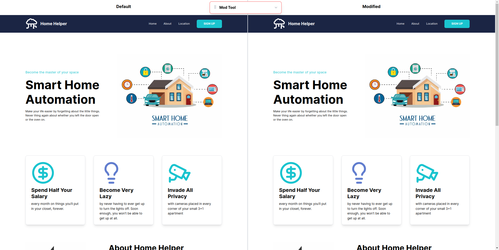
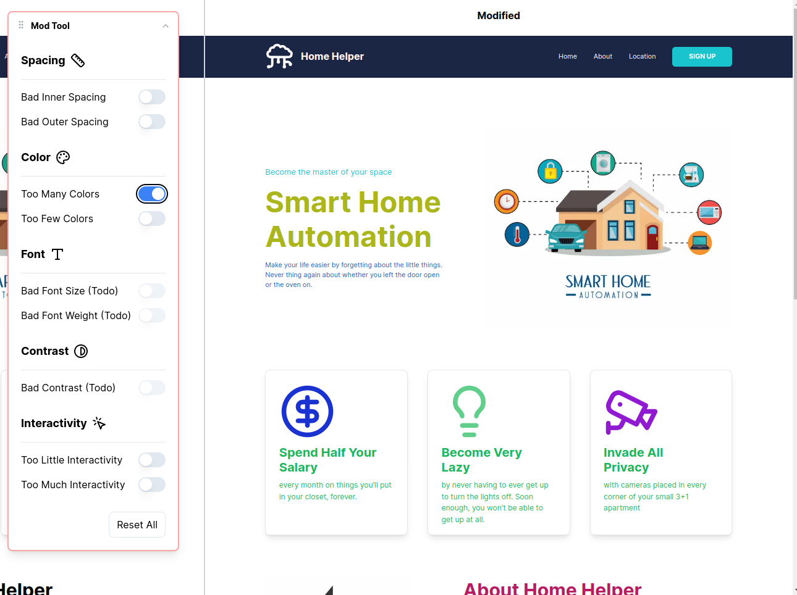

# Design Principles Interactive Demo

This app is made up of a default looking left half and a modifiable right half that the user can modify using the modtool in order to see how turning different switches on or off affects the look and feel of the site.

The user can toggle padding, margins, colors, contrast settings, etc.

Visit the live app on [design-principles.aziznal.com](https://design-principles.aziznal.com)

## Screenshots

